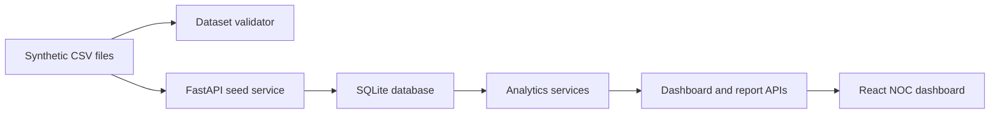

# System Architecture

## Overview

TelcoOps Insight is a local full-stack portfolio prototype.

## Backend

The backend is a FastAPI application under `backend/app`.

### Core Services:
- `config.py`: project settings and paths
- `database.py`: SQLite connection helpers with connection pooling
- `error_handlers.py`: global error handling with consistent responses
- `api_utils.py`: response formatting helpers
- `filters.py`: shared analytics filter parsing

### Routes:
- `routes/auth.py`: login, logout, user session management
- `routes/health.py`: health check endpoint
- `routes/datasets.py`: seed, upload, import history, rollback
- `routes/dashboard.py`: dashboard analytics endpoints
- `routes/executive.py`: monthly/weekly/trend executive summaries
- `routes/reports.py`: executive report JSON and HTML endpoints
- `routes/audit.py`: audit log recording and retrieval

### Enterprise Modules (TOI-0004):
- `routes/assets.py`: asset inventory and detail endpoints
- `routes/maintenance.py`: maintenance schedule and job tracking
- `routes/changes.py`: change management workflow with transitions
- `routes/rca.py`: root cause analysis with structured templates
- `routes/timeline.py`: incident timeline reconstruction

### Enterprise Services:
- `services/asset_service.py`: 7 asset types with status, ownership, capacity
- `services/maintenance_service.py`: preventive/corrective/emergency workflows
- `services/change_service.py`: planned/emergency/standard changes with approval
- `services/rca_service.py`: 5 Whys/Fishbone/Barrier analysis methods
- `services/timeline_service.py`: chronological incident event reconstruction
- `services/executive_service.py`: KPI comparison, monthly/weekly/trend summaries
- `services/recommendation_service.py`: priority scoring, business/technical impact
- `services/analytics_service.py`: KPI calculations, region/service analytics
- `services/audit_service.py`: audit trail for sensitive operations

## Frontend

The frontend is a React + Vite + TypeScript application under `frontend/src`.

- `App.tsx`: dashboard shell and section navigation
- `api/client.ts`: fetch wrapper, POST helper, CSV upload helper
- `hooks/useApi.ts`: loading/error/data state wrapper
- `pages/`: dashboard views
- `components/`: KPI cards and state views
- `types/`: API response types
- `styles/global.css`: NOC dashboard visual system

## Persistence

SQLite is stored at `backend/telco_ops.db` and is generated locally from the deterministic sample CSV bundle. The database also stores import history metadata. The database file is ignored by Git.

## Data Boundary

The project uses synthetic 2026 telecom operations data only. There is no live telemetry, real customer data, real company integration, or production authentication layer.
