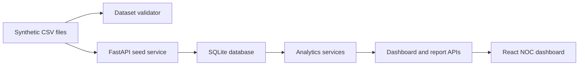

# System Architecture

## Overview

TelcoOps Insight is a local full-stack portfolio prototype.

## Backend

The backend is a FastAPI application under `backend/app`.

- `config.py`: project settings and paths
- `database.py`: SQLite connection helpers
- `routes/health.py`: health check
- `routes/datasets.py`: seed and CSV upload validation
- `routes/dashboard.py`: dashboard analytics endpoints
- `routes/reports.py`: executive report endpoints
- `services/dataset_service.py`: CSV-to-SQLite seed flow and upload validation
- `services/analytics_service.py`: deterministic KPI and dashboard calculations
- `services/recommendation_service.py`: deterministic rule evaluation
- `services/report_service.py`: JSON and HTML executive summary assembly
- `services/auth_service.py`: local demo authentication, bearer tokens, and role permissions

## Frontend

The frontend is a React + Vite + TypeScript application under `frontend/src`.

- `App.tsx`: dashboard shell and section navigation
- `api/client.ts`: fetch wrapper, POST helper, CSV upload helper
- `hooks/useApi.ts`: loading/error/data state wrapper
- `pages/`: dashboard views
- `components/`: KPI cards and state views
- `types/`: API response types
- `styles/global.css`: NOC dashboard visual system

## Persistence

SQLite is stored at `backend/telco_ops.db` and is generated locally from the deterministic sample CSV bundle. The database also stores import history metadata. The database file is ignored by Git.

## Data Boundary

The project uses synthetic 2026 telecom operations data only. There is no live telemetry, real customer data, real company integration, or production authentication layer.
